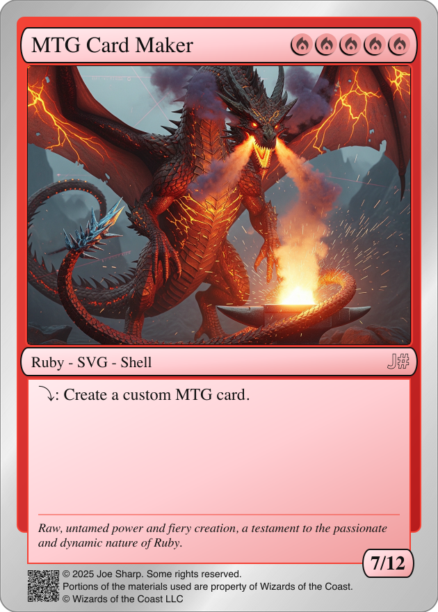
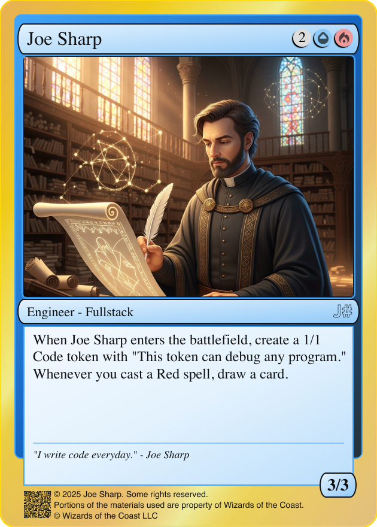

# MTG Card Maker

<p align=center>

</p>

A Ruby gem for creating fan-made Magic: The Gathering cards. This tool allows you to generate custom MTG cards with proper formatting, mana costs, and card layouts. All you need to supply is the artwork image url/path, or simply overlay on top of an image of your choosing.

Please note this gem is in early beta, and should not be used in any production application. **Using it commercially is a violation of the license.** Please suggest feature ideas you have after reviewing the open issues here: https://github.com/joe-sharp/mtg_card_maker/issues

## Features
#### 🎨 Card Customization

**Core Card Properties:**
- **Card Name**: Customizable card titles with optional font support
- **Mana Cost**: Support for 0-9, X, and all MTG mana symbols (W, U, B, R, G, C), alternate icon sets coming soon!
- **Type Line**: Customizable Card types and subtypes (Creature, Instant, Sorcery, etc.)
- **Description**: Rules text with automatic word wrapping and formatting
- **Flavor Text**: Optional italicized flavor text at the bottom of cards
- **Power/Toughness**: For creature cards, customizable power and toughness values, frame hides when omitted

**Visual Customization:**
- **Color Schemes**: 8 built-in colors (white, blue, black, red, green, colorless, gold, artifact), split colors coming soon!
- **Border Color**: Customizable border colors (white, black, gold, silver)
- **Art Integration**: Support for custom artwork via image URLs, or simply layer the svg over your art of choice

#### 🖼️ Sprite Sheet Features

**Efficiency Optimizations:**
- **Shared Assets**: Fonts, gradients, and masks defined once per sprite sheet
- **Reduced File Size**: Significantly smaller file sizes compared to individual cards
- **Layout Optimization**: Ideal for web applications, printing and digital displays

**Layout Control:**
- **Cards Per Row**: Configurable number of cards per row (default: 4)
- **Spacing Control**: Adjustable spacing between cards in pixels (default: 30)
- **Automatic Sizing**: Dynamic sprite sheet dimensions based on card count

**Batch Processing:**
- **YAML Configuration**: Define multiple cards in structured YAML files
- **CLI Integration**: Command-line tools for adding cards to YAML files
- **Error Handling**: Robust error handling for invalid configurations

#### 🛠️ Technical Features

**SVG Generation:**
- **Vector Graphics**: High-quality SVG output suitable for any size
- **Print Ready**: Optimized for both digital and print applications
- **Cross-Platform**: Compatible with all modern browsers and design software

**Development Tools:**
- **Guard Integration**: Automated testing and code quality monitoring
- **Status Summary**: Real-time development status with integrity checks
- **Comprehensive Testing**: 95%+ test coverage with RSpec
- **Code Quality**: RuboCop integration for consistent code style

**Documentation:**
- **YARD Documentation**: Comprehensive API documentation (95.96% documented)
- **CLI Help**: Detailed command-line help and examples
- **Examples**: Multiple example configurations and use cases

## Installation

### Prerequisites

This gem requires Ruby 3.2 or higher. The version of Ruby included with macOS is typically outdated and won't work. You can install a newer version of Ruby using tools like [asdf](https://asdf-vm.com/) (with the [Ruby plugin](https://github.com/asdf-vm/asdf-ruby)), [rbenv](https://github.com/rbenv/rbenv) or [RVM](https://rvm.io/). Note: This gem seems to work just fine on Ruby 3.5.0 but cannot be tested in CI currently.

Install the gem:
```bash
gem install mtg_card_maker
```

## Usage
### 🔧 Configuration Options

**Card Properties:**

Optionals without a default hide when omitted.
```yaml
name: "Card Name"                 # Required
type_line: "Creature - Dragon"    # Required
rules_text: "Card rules text"     # Required
mana_cost: 2RR                    # Optional
flavor_text: "Flavor text"        # Optional
power: 4                          # Optional
toughness: 4                      # Optional
color: red                        # Optional (default: colorless)
border_color: gold           # Optional (default: white)
art: path/to/art.jpg        # Optional
```

**Color Schemes Available:**
```rb
`artifact`  => Artifact cards (Brown, legacy)
`black`     => Black cards
`blue`      => Blue cards
`colorless` => Artifact/Land cards (Grey)
`gold`      => Multicolor cards (Metallic Gold)
`green`     => Green cards
`red`       => Red cards
`white`     => White cards
```

### 🚀 Usage Examples

### Single Card

**Generate:**
```bash
mtg_card_maker generate_card \
  --name="Lightning Bolt" \
  --mana-cost=R \
  --type-text=Instant \
  --description="Deal 3 damage to any target." \
  --color=red
```

**Add to YAML:**
```bash
mtg_card_maker add_card deck.yml \
  --name="Counterspell" \
  --mana-cost="UU" \
  --type-text="Instant" \
  --description="Counter target spell." \
  --color="blue"
```
*Shortcuts:*
- `g` or `gc` for `generate_card`
- `a` or `ac` for `add_card`

### Generate a Sprite Sheet

For printing or displaying multiple cards on a webpage, using a sprite sheet is recommended. This approach embeds fonts and gradients once per sheet instead of repeating them for each individual card, improving file size and loading efficiency.
Generate a sprite sheet from YAML configuration:

**Required Arguments:**
- `YAML_FILE`: Path to YAML configuration file
- `OUTPUT_FILE`: Output filename for the sprite sheet

**Optional Options:**
- `--cards-per-row`: Number of cards per row in sprite (default: 4)
- `--spacing`: Spacing between cards in pixels (default: 30)


```bash
mtg_card_maker generate_sprite deck.yml sprite_sheet.svg \
--cards-per-row=3 --spacing=5
```
*Shortcuts:*
- `gs` or `gcs` for `generate_sprite`

### Examples

<p>

</p>

**Generate a simple creature:**

```bash
mtg_card_maker generate_card \
  --name="Joe Sharp" \
  --mana-cost=2UR \
  --type-text="Engineer - Fullstack" \
  --description='When Joe Sharp enters the battlefield, create a 1/1 Code token with "This token can debug any program."\n\nWhenever you cast a Red spell, draw a card.' \
  --flavor-text='"I write code everyday." - Joe Sharp' \
  --power=3 \
  --toughness=3 \
  --border-color=gold \
  --color=blue
```

**Add multiple cards to a YAML file:**
```bash
mtg_card_maker add_card deck.yml --name="Lightning Bolt" --mana-cost="R" --type-text="Instant" --description="Deal 3 damage to any target." --color="red"

mtg_card_maker add_card deck.yml --name="Counterspell" --mana-cost="UU" --type-text="Instant" --description="Counter target spell." --color="blue"
```

**Generate a sprite sheet from YAML:**
```bash
mtg_card_maker generate_sprite deck.yml sprite_sheet.svg --cards-per-row=3 --spacing=20
```

## Development

### Setup

After checking out the repo, run `bin/setup` to install dependencies. Then, run `bundle exec rspec` to run the tests. You can also run `bin/console` for an interactive prompt that will allow you to experiment.

### Development Workflow with Guard

This project uses [Guard](https://github.com/guard/guard) for automated testing and code quality checks during development. Guard monitors file changes and automatically runs relevant tests and checks.

**Start Guard:**
```bash
bundle exec guard
```

**What Guard monitors:**
- **RuboCop**: Automatically checks code style when Ruby files change
- **RSpec**: Runs tests when spec files or corresponding lib files change
- **Status Summary**: Monitors changes and runs `bin/status_summary` to check card generation integrity (end-to-end tests)

**Guard Output:**
- RuboCop results are saved to `tmp/rubocop_status.txt`
- RSpec results are saved to `tmp/rspec_status.txt`
- Status summary provides real-time feedback on code quality and card generation

### Status Summary Script

The `bin/status_summary` script provides a comprehensive development status overview, it is meant to only be run by guard.

**What it does:**
- Generates test cards and sprite sheets to verify functionality
- Compares generated output against expected fixtures
- Checks for unexpected changes in SVG files
- Displays status indicators, requires you run with guard:
  - ✅ RuboCop violations (with count if any)
  - ✅ RSpec test failures (with count if any)
  - ✅ Card generation integrity
  - ✅ Sprite sheet generation integrity

**Status Indicators:**
- `✅` - All good
- `⚠️` - Issues detected (with count)
- `❌` - Failures
- `🔄` - Unexpected changes detected

### Interactive Development

**Console:**
```bash
bin/console
```

Start an interactive Ruby console with the gem loaded for experimentation.

**Manual Testing:**
Note: just use guard
```bash
# Run all tests
bundle exec rspec

# Check code style
bundle exec rubocop

# Generate test cards

# See examples above, but you will need to use bin/mtg_card_maker from the project root to use the in-development code.

# Or run `bundle exec guard` and monitor output_card.svg and color_cards_sprite.svg for changes, it is far better, really.
```

## Documentation

### API Documentation

The gem includes comprehensive YARD documentation for all classes and methods. You can generate and view the documentation locally:

**Generate Documentation:**
```bash
bundle exec yard doc
```

**Serve Documentation Locally:**
```bash
bundle exec yard server
```
Then visit `http://localhost:8808` to browse the documentation.

### Key Classes

- **MtgCardMaker**: Main module with card generation examples
- **BaseCard**: High-level card creation interface
- **Template**: SVG canvas and layer management
- **BaseLayer**: Abstract base class for all card layers
- **ColorScheme**: Unified color system for all MTG colors
- **LayerFactory**: Factory pattern for creating card layers
- **CLI**: Command-line interface with Thor integration

### Installation and Release

To install this gem onto your local machine, run `bundle exec rake install`. To release a new version, update the version number in `version.rb`, and then run `bundle exec rake release`, which will create a git tag for the version, push git commits and the created tag, and push the `.gem` file to [rubygems.org](https://rubygems.org).

## Contributing

Bug reports and pull requests are welcome on GitHub at https://github.com/joe-sharp/mtg_card_maker. This project is intended to be a safe, welcoming space for collaboration, and contributors are expected to adhere to the [code of conduct](https://github.com/joe-sharp/mtg_card_maker/blob/main/CODE_OF_CONDUCT.md).

## License

<a href="https://projects.joe-sharp.com/mtg_card_maker">MTG Card Maker</a> © 2025 by <a href="https://github.com/joe-sharp/mtg_card_maker">Joe Sharp</a> is licensed under <a href="https://creativecommons.org/licenses/by-nc-nd/4.0/">CC BY-NC-ND 4.0</a> 

The gem is available as open source under the terms of this license.

## Copyright

© 2025 Joe Sharp. Some rights reserved.
MTG Card Maker is unofficial Fan Content permitted under the [Fan Content Policy.](https://company.wizards.com/en/legal/fancontentpolicy) Not approved/endorsed by Wizards. Portions of the materials used are property of Wizards of the Coast. © Wizards of the Coast LLC.

The removal or alteration of copyright notices, attributions, and/or QR codes from generated images constitutes a material breach of the license agreement. All copyright notices and identifying marks must remain intact and unmodified in accordance with the terms of use.

## Code of Conduct

Everyone interacting in the MTG Card Maker project's codebases, issue trackers, chat rooms and mailing lists is expected to follow the [code of conduct](https://github.com/joe-sharp/mtg_card_maker/blob/main/CODE_OF_CONDUCT.md).
